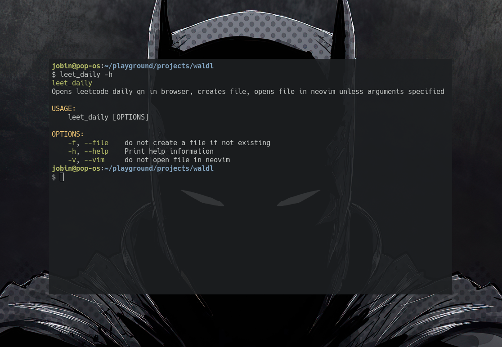

# Leet Daily

A tool written in rust that helps you minimize the friction of doing leetcode.

Opens today's question in brave browser, opens new file in neovim and populates necessary details. The tool is setup to produce a new python file at `$HOME/playground/learn/competitive_programming/${month}/`. You can change the location to suit your need

## Install

1. Clone the repo to anywhere in your system
    - `git clone --depth 1 https://github.com/Jobin-Nelson/leet_daily.git`

2. cd into leet_daily, and build the binary
    - `cargo build --release`

3. move the binary to somewhere in your `$PATH` variable, for me it is `$HOME/script/`
    - `mv target/release/leet_daily ~/script/`

## Dependencies

- **reqwest**
- **clap**
- **serde**

